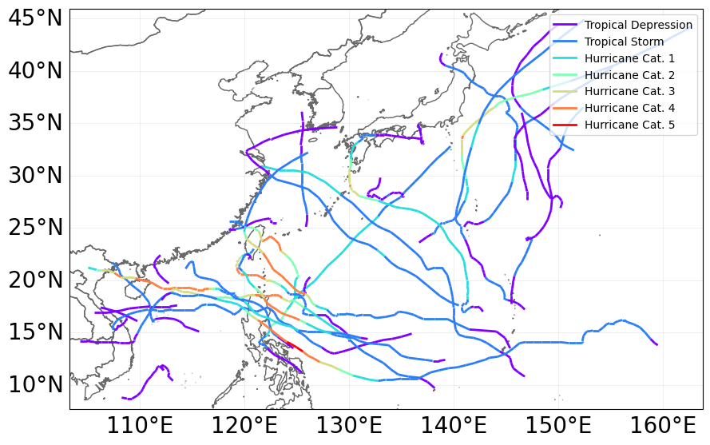

## Hazard Risk Assesment with CLIMADA for Tropical Storms in Southeast Asia
<figure>
  
  <figcaption>Southeast Asia Typhoon 2024</figcaption>
</figure>
  
This repository contains only source code in Jupyter Notebook (Python) and Power BI. For description and details of the project, please visit the [website version](https://sites.google.com/view/salmiah-ls/home#h.em82epcfyhb8)

This repository consists of 3 parts:
- [Mapping Typhoons in Southeast Asia](https://github.com/salmiah-ls/Hazard-Risk-Assesment-with-AI-for-Tropical-Storms-in-Southeast-Asia/tree/main/Mapping-Typhoons)
- [Typhoon Haiyan, November 2013: Central Philippines](https://github.com/salmiah-ls/Hazard-Risk-Assesment-with-AI-for-Tropical-Storms-in-Southeast-Asia/tree/main/Haiyan-Philippines-2013)
- [Typhoon Yagi, September 2024: Northern Vietnam](https://github.com/salmiah-ls/Hazard-Risk-Assesment-with-AI-for-Tropical-Storms-in-Southeast-Asia/tree/main/Yagi-Vietnam-2024)

  
